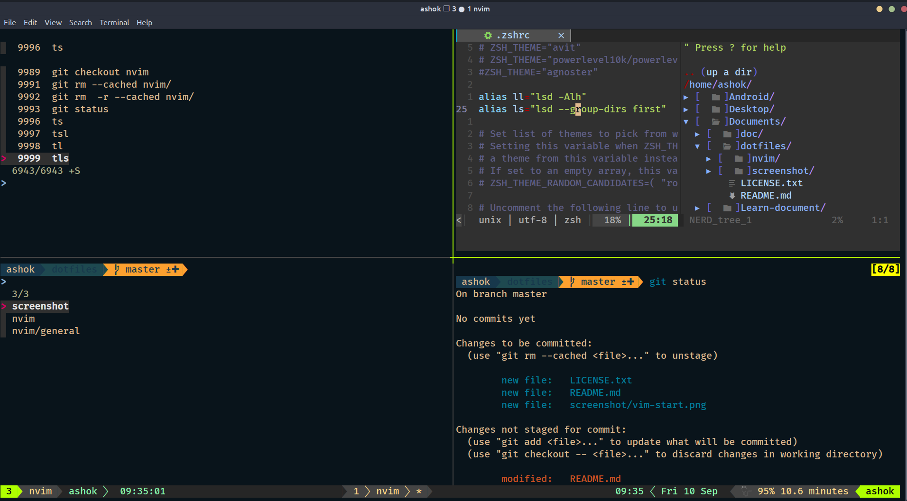

# Dotfiles for terminal
 
 After this config your terminal may look like this

## Basic Steps
- Install nvim
- Clone repo 
  - `git clone https://github.com/AlxPatidar/dotfiles.git`
- Copy repo nvim folder contain in `~/.vimrc` or `vim.init`
   - mv nvim/ ~/.config/nvim/
   - Clt-v and Clt-c we know how it work
- Then type `:PlugInstall`
- When all plugin install then :q or Clt+zz
- Again type `vim` or `nvim`

## Basic Installation
  
  1) [Oh-my-zsh](https://github.com/ohmyzsh/ohmyzsh)
  2) [Tmux](https://github.com/tmux/tmux/wiki/Installing)
  3) [FZF](https://github.com/junegunn/fzf)
  2) Terminal Theme
   `bash -c  "$(wget -qO- https://git.io/vQgMr)"`

## License

Oh My Zsh is released under the [MIT license](LICENSE.txt).

## Stay in touch

- Author - [Ashok Patidar](https://github.com/AlxPatidar)
- Stackoverflow - [Ashok](https://stackoverflow.com/users/10893484/ashok)
- Github - [Alx Patidar](https://github.com/AlxPatidar)